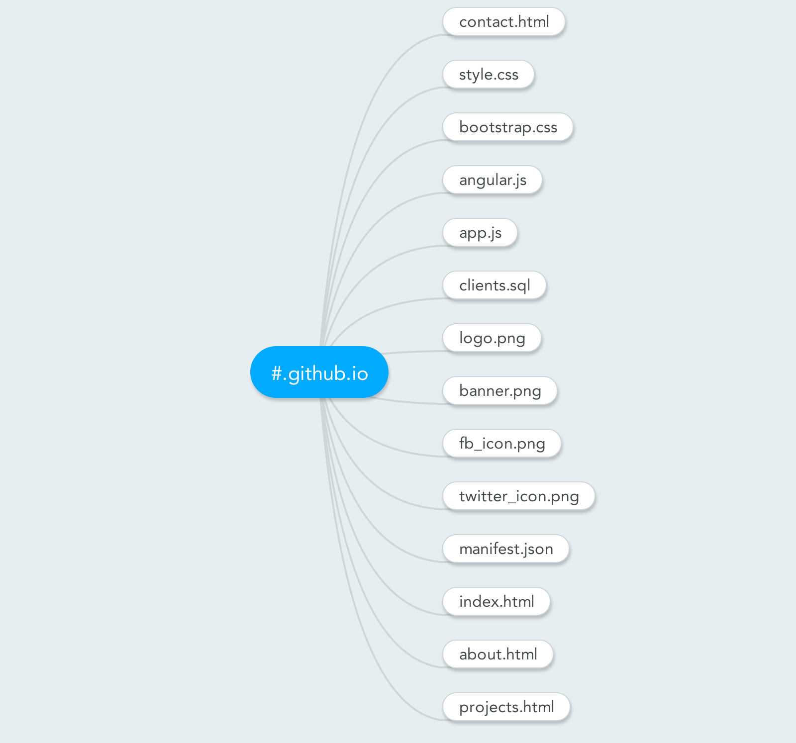
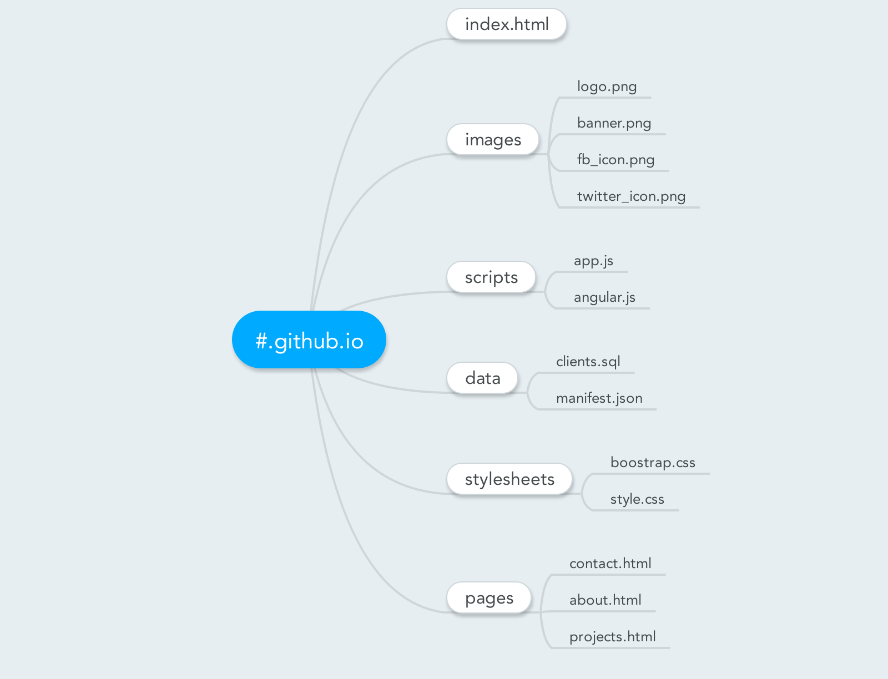

# file_organization

While you're not working within a framework, there's no "wrong" way to structure your files--however, there are better ways to do so to improve your workflow.

Remember that you're rarely going to be working on a project by yourself, so always structure your files in a way that will be easily understood by your teammates.

If all the files in a repository are stored in the root directory, then we would have to look through the files one by one. In the worst-case scenario, we would have to look at all of them before we find the file we're looking for.

Let's count every time we check whether a file is what we're looking for as one step. In this example, in order to find `projects.html`, we would take 14 steps.

However, if our files are organized by category, we can search in the first "level" of the root directory for file types, and skip looking inside directories that we don't want. In this file structure, we would take six steps to find the `pages` directory, and then three steps to find `projects.html`--nine steps total. Even though `projects.html` is still the last file in the last directory, we've saved five steps while searching for this file, because we can eliminate the "branches" of this tree that we don't want to search.

There are a ton of ways you could do this--just remember to name files and directories in a way that makes sense to you and your team!